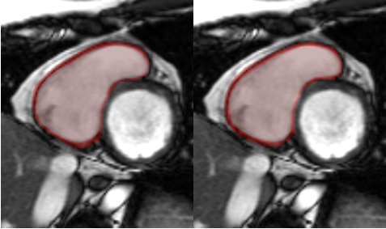

Here is [English README](README.md).

本项目介绍博客[CSDN](https://blog.csdn.net/Omigeq/article/details/135882653)，内含更多信息。

## 准备

创建工作目录，并拉取代码。

```
mkdir ws
cd ws
git clone https://github.com/omigeft/RVSC-Medical-Image-Segmentation.git src
```


在Ubuntu 22.04、RTX 4090 * 1、CUDA 12.1、Python=3.10、torch=2.1.2、torchvision=0.16.2上测试可以顺利运行。其他类似版本也应适用。

要安装其他所需的软件包，请运行：

```sh
pip install -r requirements.txt
```

要使训练过程可视化，您需要在[Weights&Biases](https://wandb.ai/)上注册一个帐户。然后运行以下命令进行登录。

```sh
wandb login
```

## 数据预处理

从[https://rvsc.projets.litislab.fr/](https://rvsc.projets.litislab.fr/)下载数据集，
解压数据集到`ws`目录下，手动整理数据集文件结构如下：

```
/TrainingSet
/TestSet/
  - /Test1Set
  - /Test2Set
  - /Test1SetContours
  - /Test2SetContours
```

进入源代码目录，运行`data_preprocess.py`，自动处理RVSC数据集为可训练的格式并进行数据增广。 可以使用`-t`参数指定数据额外增广的倍数。 

```sh
cd src
python data_preprocess.py -t 4
```

## 训练

在源代码目录，运行`train.py`，开始训练。

```sh
python train.py \
--model unet \
--imgs ../train_data_aug/imgs/ \
--masks ../train_data_aug/i-masks/ \
--save ../i-checkpoints/ \
--epochs 50 \
--batch-size 64 \
--scale 0.5 \
-w 1e-4 \
-epc 5 \
-ls dice+ce \
-o adam \
--amp
```

如果CUDA显存不足，请尝试减小`batch-size`或缩小图像的比例`scale`。相反，如果GPU资源充足且想要获得更好的训练效果，请尝试增加`batch-size`、使用原始图像比例`--scale 1`或去掉`--amp`参数。 

## 预测

```sh
python predict.py \
--pth ../i-checkpoints/unet_checkpoint_epoch50.pth \
--input ../train_data/imgs/P01-0080.png \
--scale 0.5 \
--viz \
--no-save
```

## 利用测试集评估模型

```sh
python eval_test.py \
--pth ../i-checkpoints/unet_checkpoint_epoch50.pth \
--input ../test1_data/imgs/ \
--output ../test1_data/i-masks \
--scale 0.5
```

## 分割结果

经过测试，效果最好的模型是UNet++。以下是一些分割结果的展示，左边的图片为UNet++的分割结果，右边的图片为真实标注数据。




## 致谢

本项目参考了以下代码：

* [milesial/Pytorch-UNet](https://github.com/milesial/Pytorch-UNet)
* [WZMIAOMIAO/deep-learning-for-image-processing](https://github.com/WZMIAOMIAO/deep-learning-for-image-processing)
* [CSDN blog](https://blog.csdn.net/qq_43205656/article/details/121191937)

在此表示感谢。

## 开源协议

本项目采用[GPL-3.0 licence](LICENSE)协议开源。